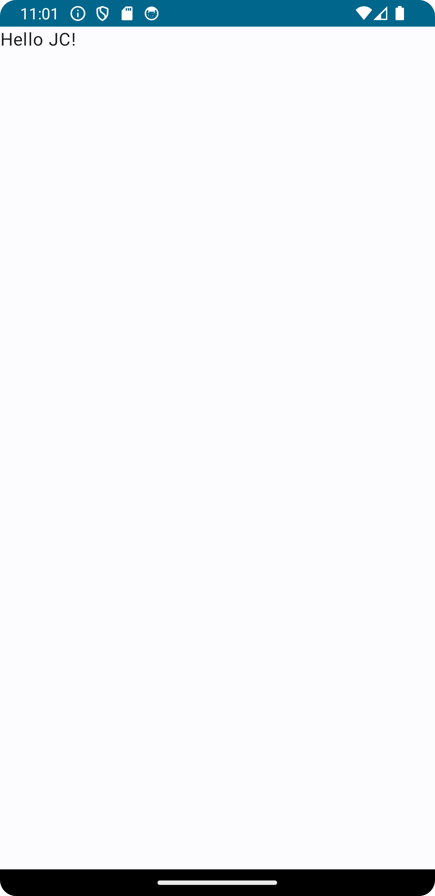
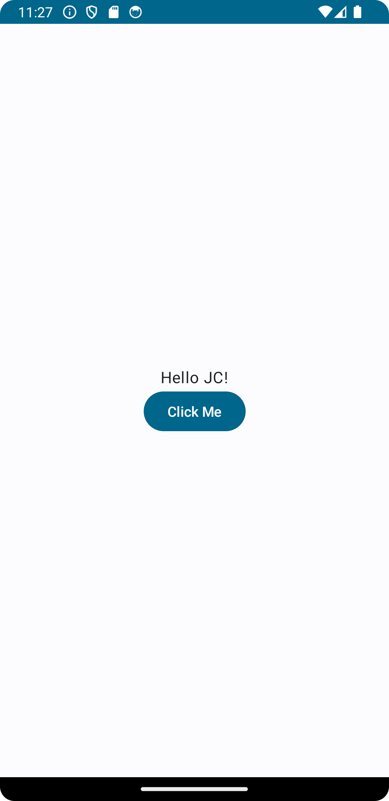
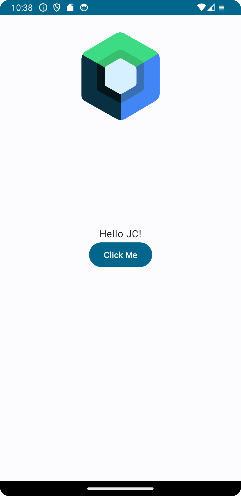
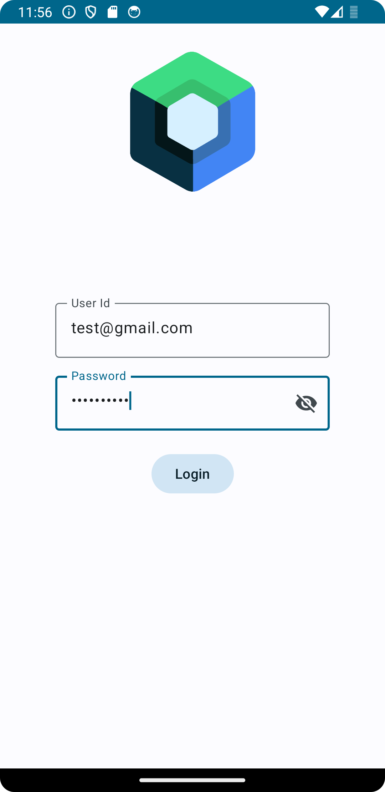
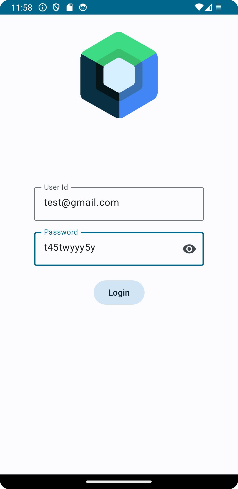

# composeforbeginner

ScreenShot of my first Hello JC app

ScreenShot of center align text

ScreenShot of center align text with button

ScreenShot of image with center align text and button

Login Page Screenshot with show/hide password

